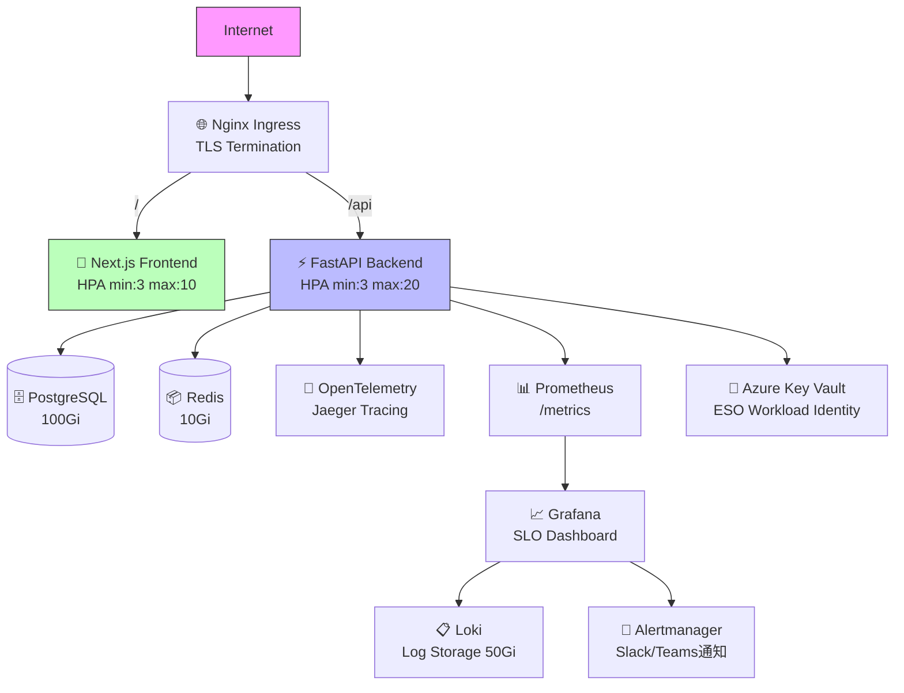

# ZeroTrust ID Governance - Helm Chart

[](https://github.com/Kensan196948G/ZeroTrust-ID-Governance)
[](https://ghcr.io/kensan196948g/charts)
[](LICENSE)

Zero Trust アーキテクチャに基づく Identity & Access Management プラットフォームの Helm Chart。

---

## 📦 概要

| 項目 | 内容 |
|---|---|
| Chart バージョン | v1.3.0 |
| App バージョン | v1.0.0 |
| Kubernetes | >= 1.25 |
| 認証 | JWT RS256 + リフレッシュトークン失効制御 |
| 認可 | RBAC 細粒化（require_any_role） |
| ネットワーク | NetworkPolicy Zero Trust（Deny All + 明示的許可） |
| Observability | Prometheus + OTEL + Grafana + Loki + Alertmanager |
| Secrets管理 | ESO + Azure Key Vault Workload Identity |

---

## 🚀 インストール

### OCI Registry から（推奨）

```bash
helm install zerotrust-id-governance \
  oci://ghcr.io/kensan196948g/charts/zerotrust-id-governance \
  --version 1.3.0 \
  --namespace zerotrust \
  --create-namespace
```

### ローカル chart から

```bash
helm install zerotrust-id-governance . \
  --namespace zerotrust \
  --create-namespace
```

### 本番環境（values-prod.yaml 使用）

```bash
helm upgrade --install zerotrust-id-governance \
  oci://ghcr.io/kensan196948g/charts/zerotrust-id-governance \
  --version 1.3.0 \
  -f values-prod.yaml \
  --namespace zerotrust-prod \
  --create-namespace
```

> ⚠️ `values-prod.yaml` 内の `REPLACE_` プレフィックスの値を必ず実際の値に置換してください。

---

## ⚙️ 主要設定値

### バックエンド (FastAPI)

| パラメータ | デフォルト | 説明 |
|---|---|---|
| `backend.replicaCount` | `2` | レプリカ数 |
| `backend.autoscaling.enabled` | `false` | HPA 有効化 |
| `backend.autoscaling.minReplicas` | `2` | 最小レプリカ（本番: 3） |
| `backend.autoscaling.maxReplicas` | `10` | 最大レプリカ（本番: 20） |
| `backend.resources.requests.cpu` | `250m` | CPU リクエスト |
| `backend.resources.requests.memory` | `256Mi` | メモリリクエスト |

### フロントエンド (Next.js)

| パラメータ | デフォルト | 説明 |
|---|---|---|
| `frontend.replicaCount` | `2` | レプリカ数 |
| `frontend.autoscaling.enabled` | `false` | HPA 有効化 |

### Ingress

| パラメータ | デフォルト | 説明 |
|---|---|---|
| `ingress.enabled` | `false` | Ingress 有効化 |
| `ingress.className` | `nginx` | Ingress クラス |

### セキュリティ

| パラメータ | デフォルト | 説明 |
|---|---|---|
| `networkPolicy.enabled` | `false` | Zero Trust NetworkPolicy（本番: true） |
| `externalSecrets.enabled` | `false` | Azure Key Vault ESO（本番: true） |

### Observability

| パラメータ | デフォルト | 説明 |
|---|---|---|
| `grafana.enabled` | `false` | Grafana ダッシュボード |
| `logging.enabled` | `false` | Loki + Fluent Bit ログ収集 |
| `tracing.enabled` | `false` | OTEL + Jaeger 分散トレーシング |
| `alerting.enabled` | `false` | Alertmanager アラート通知 |
| `slo.enabled` | `false` | SLO/SLI ダッシュボード |

### リソース管理

| パラメータ | デフォルト | 説明 |
|---|---|---|
| `resourceQuota.enabled` | `false` | Namespace ResourceQuota（本番: true） |
| `limitRange.enabled` | `false` | コンテナ LimitRange（本番: true） |

---

## 🔐 本番環境設定 (values-prod.yaml)

`values-prod.yaml` で全セキュリティ機能を有効化した本番推奨設定を提供しています。

```bash
# values-prod.yaml ダウンロード
curl -O https://raw.githubusercontent.com/Kensan196948G/ZeroTrust-ID-Governance/main/helm/zerotrust-id-governance/values-prod.yaml
```

**置換が必要なプレースホルダー:**

| プレースホルダー | 内容 |
|---|---|
| `REPLACE_WITH_RELEASE_TAG` | イメージタグ（例: `v1.0.0`） |
| `REPLACE_WITH_YOUR_DOMAIN` | ドメイン名（例: `ztiam.example.com`） |
| `REPLACE_WITH_KEYVAULT_NAME` | Azure Key Vault 名 |
| `REPLACE_WITH_AZURE_TENANT_ID` | Azure テナント ID |

---

## 🏗 アーキテクチャ



---

## 📊 SLO/SLI 設定

| SLO | 目標値 | ウィンドウ |
|---|---|---|
| 可用性 (Availability) | **99.9%** | 30日 |
| レイテンシ P99 | **500ms 以下** | 30日 |
| Error Budget | 43.8分/月 | 30日 |

**Multi-Window Burn Rate アラート:**

| アラート | バーンレート | ウィンドウ | 重要度 |
|---|---|---|---|
| Fast Burn (critical) | 14.4x | 1時間 | 🔴 critical |
| Slow Burn (warning) | 6x | 6時間 | 🟡 warning |

---

## 🔑 Secrets 管理

本番環境では External Secrets Operator (ESO) + Azure Key Vault を使用:

```yaml
externalSecrets:
  enabled: true
  azureKeyVault:
    vaultUrl: "https://your-vault.vault.azure.net/"
    tenantId: "your-tenant-id"
  auth:
    type: workloadIdentity
    serviceAccountRef:
      name: zerotrust-sa
  refreshInterval: "15m"
```

---

## 📋 前提条件

| 依存 | バージョン | 用途 |
|---|---|---|
| Kubernetes | >= 1.25 | クラスタ |
| Helm | >= 3.12 | Chart 管理 |
| cert-manager | (本番推奨) | TLS 自動発行 |
| nginx-ingress | (本番推奨) | Ingress |
| External Secrets Operator | (本番必須) | Secrets 管理 |
| Prometheus Operator | (SLO機能に必要) | PrometheusRule CRD |
| Calico/Cilium CNI | (NetworkPolicy機能に必要) | Zero Trust Network |

---

## 📚 参考リンク

- [GitHub Repository](https://github.com/Kensan196948G/ZeroTrust-ID-Governance)
- [API Docs](https://your-domain/api/docs)
- [ArtifactHub](https://artifacthub.io/packages/helm/zerotrust-id-governance/zerotrust-id-governance)
